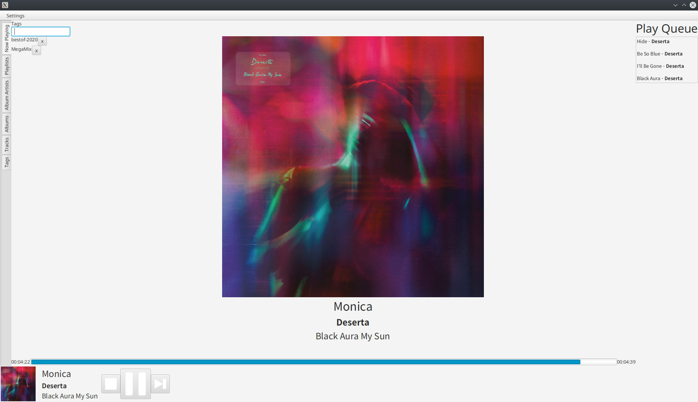
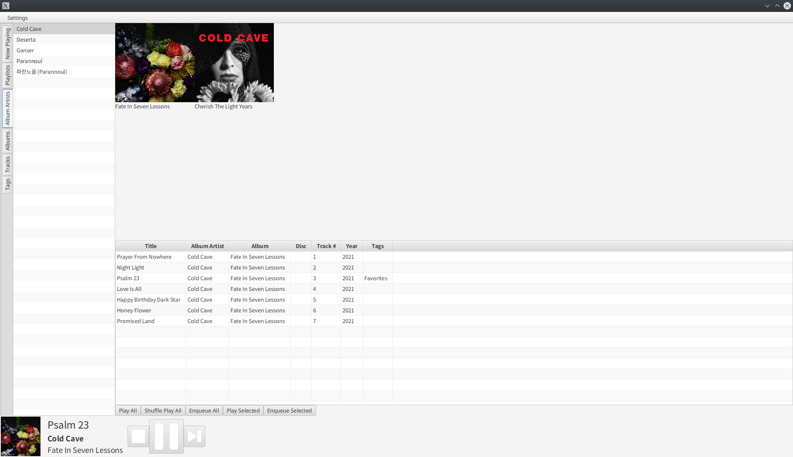
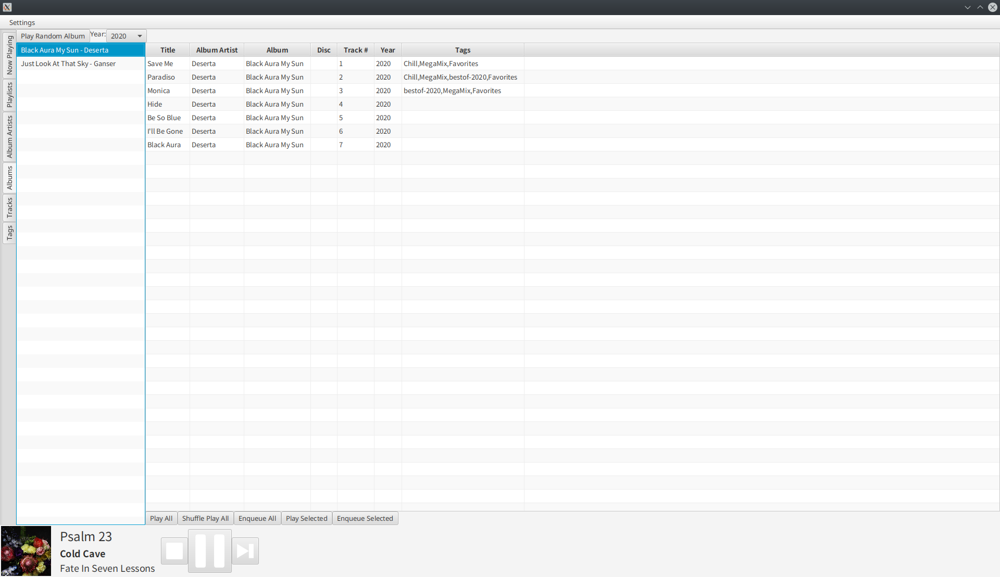
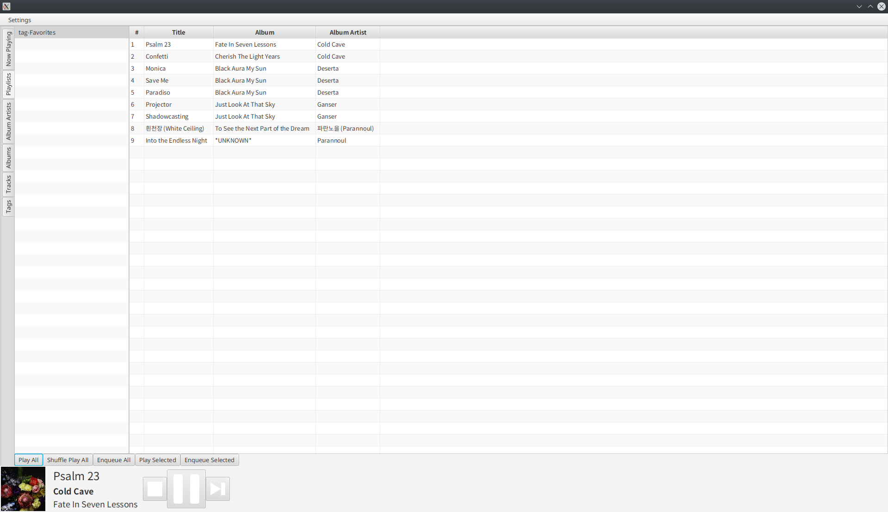
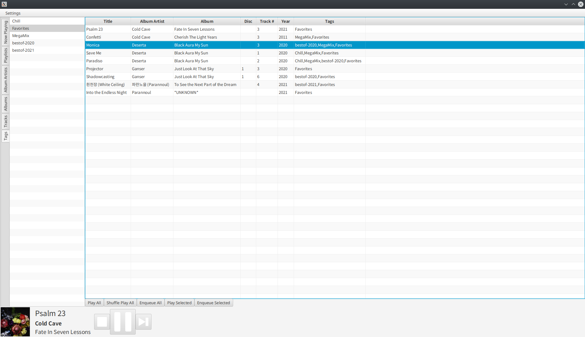

# JaMM (JavaFx Music Manager)
## Intro
JaMM is a queue-based music library and player. 
It supports MP3 and OGG Vorbis. 
Other formats may be supported but are as yet untested.

## Features

- [Now Playing](#now-playing)
- [Album Artists](#album-artists)
- [Albums](#albums)
- [Playlists](#playlists)
- [Tags](#tags)
- [Tracks](#tracks)
- Last.FM Scrobbling
- Continuous Play Mode (plays random tracks when queue is empty)

### Now Playing

### Album Artists
This view groups album by that Album Artist and lets you select an Artist to see all that artist's albums with their covers.
You can then select an album to view it in the track listing below.

### Albums
This view groups tracks by album and lets you select an album to view it in the track listing.
It also has a button to play a random album, and a filter for album year.

### Playlists
This view allows you to view and play traditional m3u playlist files in your music directory.
It also has a button to play a random album, and a filter for album year.

### Tags
Tags are the most unique feature to this application.
Tags let you group songs together, and they are ideal for large playlists without a defined order.
You can tag each track with arbitrary tags. These are stored in the file's metadata themselves, 
so they will not break if the file moves (like a traditional playlist).
You can also export tags to an m3u file for compatibility with other players.

### Future Features

- Editing playlists
- more filters in track and album view
- filters for album artist view
- More Audio Formats
- Installers for more architectures
- More options for continuous play mode
- Dark Mode

## Getting Started

### Installation

#### Portable Zip
This method will work on almost any computer with Java 17.
- Make sure you have Java 17 installed and set as your default Java version.
- Download the zip file from the [latest release](https://github.com/wakingrufus/JaMM/releases/latest)
- In the directory, run `./bin/desktop` for linux/mac or `./bin/desktop.bat` for windows.

#### Debian Linux
This method is preferred for Debian linux. It requires no Java to be installed.
Download the `.deb` from the [latest release](https://github.com/wakingrufus/JaMM/releases/latest) and install it with your package manager.

### Set music library directory
The default Music library directory is `~/Music`. To change this, use the Settings menu.

## For Developers

to run desktop app `./gradlew desktop:run`

to create distributions `./gradlew desktop:jpackage`